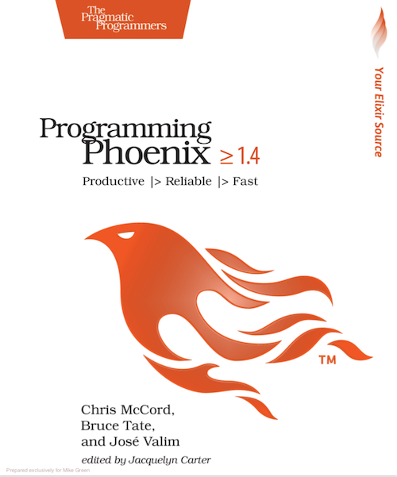

export { default as theme } from './lib/theme'
import { Split } from 'mdx-deck/layouts'
import Snippet from './lib/snippet';

# Elixir & Phoenix

---

# About Elixir

---

export default Split

+ Runs on the Erlang VM
+ Started as a research project by José Valim
+ Syntax influenced by Ruby, programming paradigm more similar to Erlang or Clojure
+ Provides a friendlier syntax for developing massively concurrent, fault tolerant apps

---

# On the Shoulders of Giants

---

# Erlang Features

+ Functional
+ Distributed
+ Immutable data
+ Pattern matching
+ Applications are "Write once, run forever" - Joe Armstrong
+ Open Telecom Platform built into the standard library

---

# WTF is OTP?

Basically the Erlang ecosystem and runtime:

+ Compiler
+ Debugger
+ Observer for running apps
+ Process manager
+ Distributed DB and key/value storage services
+ SNMP interface
+ Cooperative process scheduler
+ Test runner
+ Coverage analyzer

---

# Notable Uses

+ Telecommunications (Ericsson, probably everyone else too)
+ Banking, Finance, Real-time trading (Goldman Sachs)
+ Instant messaging (ejabberd, WhatsApp)
+ Spam prevention at Pinterest

---

<Snippet
  title="Syntax is a little confusing, though"
  lang="erlang"
  code={require('!raw-loader!./snippets/00-quicksort.erl')}
  notes="Erlang evolved from Prolog"
/>

---

<Snippet
  title="After a bit of alchemy..."
  code={require('!raw-loader!./snippets/00-quicksort.ex')}
  notes="It does the same thing, but coming from Ruby, this is much more intelligible to me at first glance"
/>

---

# Features

---

<Snippet
  title="First-class Functions"
  code={require('!raw-loader!./snippets/01-anonymous-functions.ex')}
  steps={[
    { notes: 'Anonymous functions are values like any other' },
    { lines: [1], notes: 'Defined using the "fn" keyword, terminated with "end"' },
    { lines: [2], notes: 'Capture syntax defines functions more succinctly' },
    { range: [4, 7], notes: 'Called with .() to differentiate them from module functions' },
    { range: [9, 18], notes: 'Functions can have guards and different clauses' }
  ]}
/>

---

<Snippet
  title="Data Types"
  code={require('!raw-loader!./snippets/02-data-types.ex')}
  steps={[
    { range: [1, 3], notes: 'Strings are "binaries" - collections of bytes' },
    { lines: [5, 6], notes: 'Concatenate a string with the null byte to see its raw binary value' },
    { range: [8, 11], notes: 'Concatenation operator returns a new string' },
    { lines: [13, 14], notes: 'Interpolation also works' },
    { range: [16, 18], notes: 'Linked list data structures can contain any combo of types' },
    { range: [23, 25], notes: 'Single quoted "strings" are actually charlists (linked lists of character codepoints)' },
    { range: [23, 25], notes: 'Charlists are mostly used to interact with Erlang libraries that lack binary support' },
    { lines: [27], notes: 'Tuples are used extensively to report success/failure along with a function return value' },
    { lines: [29, 30], notes: 'Keyword lists compile to lists of 2-member tuples' },
    { lines: [32], notes: 'Maps are an un-ordered key/value structure where anything can be a key or a value.' },
    { range: [33, 36], notes: 'Maps have the usual key dereferencing notation' }
  ]}
/>

---

<Snippet
  title="Modules"
  code={require('!raw-loader!./snippets/03-modules.ex')}
  steps={[
    { notes: 'Modules are used to group and namespace functions, structs, and macros' },
    { range: [2, 4], notes: 'Documentation is built into the language using attributes and multiline, Markdown formatted strings' },
    { lines: [6], notes: 'Attributes are resolved to their values at compile time, like constants' },
    { range: [8, 15], notes: '@doc tags are available as online help in IEX REPL and can be turned into HTML API docs' },
    { range: [16, 22], notes: 'Modules can have multiple function clauses with the same name. Pattern matching and guards are used to invoke the correct one.' },
    { range: [20, 22], notes: 'Guard clauses check arguments, and must use pure functions with no side effects' },
    { range: [31, 39] },
    { lines: [32], notes: 'Default arguments are specified using two backslashes' },
    { lines: [36], notes: 'Private methods in modules are defined using the "defp" macro' }
  ]}
/>

---

<Snippet
  title="Pattern Matching"
  code={require('!raw-loader!./snippets/04-pattern-matching.ex')}
  steps={[
    { notes: 'Pattern matching is used heavily in Elixir code' },
    { range: [1, 8], notes: 'Elixir supports multiple function clauses and will execute the first one whose signature matches the arguments' },
    { range: [2, 5], notes: 'This clause destructures the first item from the rest of the list, prints it, and re-runs the function with the remaining items' },
    { lines: [7], notes: 'This clause only matches an empty list, and simply returns nil without recursing' },
    { range: [16, 18], notes: 'MANY Elixir functions return a tuple of status + result rather than throwing exceptions' },
    { range: [20, 30] },
    { lines: [21], notes: 'Modules can define Structs, maps that function as data structures with default attributes and validation' },
    { range: [23, 25], notes: 'User.to_s/1 will throw an exception if not passed a %User{} struct' },
    { range: [27, 29], notes: 'We can also destructure only certain struct attributes. This function will have a local "role" variable in scope' },
    { range: [32, 41] },
    { lines: [37, 38], notes: 'Pattern matching is smart enough to know that this IS NOT a User struct' },
    { range: [43, 50], notes: 'We can even use pattern matching to grab substrings' }
  ]}
/>

---

<Snippet
  title="Conditionals"
  code={require('!raw-loader!./snippets/05-conditionals.ex')}
  steps={[
    { notes: 'Elixir has a couple interesting conditionals besides "if" and "unless"' },
    { range: [15, 19], notes: 'The "case" statement does pattern matching on a single value' },
    { lines: [16], notes: 'Can partially match the value based on the pattern specified' },
    { lines: [17], notes: 'Can also bind variables that can be used in the body of the conditionally executed expression' },
    { lines: [18], notes: 'Underscore is a wildcard - matches anything and everything' },
    { range: [22, 30], notes: 'cond statements can test multiple different statements for truthiness' },
    { range: [32, 38], notes: "If and unless work like you'd expect" }
  ]}
/>

---

<Snippet
  title="Enumerables and Pipelines"
  code={require('!raw-loader!./snippets/06-enums-pipelines.ex')}
  steps={[
    { notes: 'The Enum module operates on ranges, lists, maps, etc.' },
    { range: [4, 7], notes: 'Two equivalent calls to Enum.map' },
    { range: [12, 18], notes: "The pipe operator passes the previous expression's return value into the next function's first argument slot" },
    { lines: [15], notes: 'Every integer between 1 and 100,000' },
    { lines: [16], notes: 'Multiplied by 3' },
    { lines: [17], notes: 'Even numbers removed' },
    { lines: [18], notes: 'Return the sum of the list' },
    { lines: [20, 21], notes: 'It gets a lot harder to read without pipes' },
    { range: [12, 18], notes: 'Enum functions are eagerly evaluated, so intermediate results are calculated at each step' },
    { range: [23, 28], notes: 'The Stream module queues functions until something requires a value. No intermediate values.' },
    { lines: [28], notes: 'Nothing is actually calculated until we get here.' }
  ]}
/>

---

<Snippet
  title="Comprehensions"
  code={require('!raw-loader!./snippets/07-comprehensions.ex')}
  steps={[
    { notes: 'Comprehensions act as looping constructs, as well as generators and ways to map enumerables' },
    { lines: [1, 2], notes: 'Equivalent to mapping and squaring a list of numbers' },
    { range: [4, 6], notes: 'Comprehensions can have an optional filter function' },
    { range: [8, 10], notes: 'Generator expressions support pattern matching to filter comprehensions too' },
    { range: [12, 18], notes: 'More generic usage as a loop construct is seen in templates' }
  ]}
/>

---

# Concurrency

Elixir lets us use Erlang/OTP for ridiculous levels of concurrency.

+ Process
+ Task
+ Agent
+ GenServer
+ Supervisor

---

<Snippet
  title="Processes"
  code={require('!raw-loader!./snippets/08-processes.ex')}
  steps={[
    { notes: 'All Elixir code runs in lightweight Erlang processes' },
    { notes: 'Processes are rarely used directly' },
    { range: [1, 8], notes: 'Process share no memory - they pass messages' },
    { range: [1, 8], notes: 'This process is talking to itself' },
    { lines: [3], notes: 'Sends an async message to the mailbox of the specified process' },
    { range: [5, 8], notes: 'Blocks and checks the mailbox for matching messages, executing the first matching clause' },
    { range: [11, 13], notes: 'Run a function in a new process' },
    { range: [15, 18], notes: 'Synchronously check for a message from the process and do something with it' },
    { lines: [20, 21], notes: 'The process exits when the function is done executing' }
  ]}
/>

---

<Snippet
  title="Tasks"
  code={require('!raw-loader!./snippets/09-tasks.ex')}
  steps={[
    { notes: 'Tasks are used for one-off async operations' },
    { range: [1, 4], notes: 'This function runs in another process' },
    { range: [6, 8], notes: 'Allowing subsequent code to run without being blocked' },
    { lines: [9], notes: 'Until Task.await is called and grabs the result' }
  ]}
/>

---

<Snippet
  title="Agents"
  code={require('!raw-loader!./snippets/10-agents.ex')}
  steps={[
    { notes: 'Agents are an abstraction that helps apps maintain state so that multiple processes can access it' },
    { lines: [2], notes: 'The "use" keyword imports a module and its macros, and executes a callback function' },
    { range: [4, 7], notes: 'Starts an agent that gets its state from a function' },
    { tokens: { 6: [12] }, notes: 'Resolves at compile time to "Counter"' },
    { range: [9, 12], notes: 'Tells the agent how to retrieve its value' },
    { range: [14, 17], notes: 'Passes a function to the agent that it applies to the current value to derive a new one' },
    { range: [20, 26], notes: 'This module can be called by any process in the app to talk to the Counter agent' }
  ]}
/>

---

# But how do you build web apps?

---

---

# About Phoenix

+ MVC with a couple Elixir/Erlang/OTP twists

